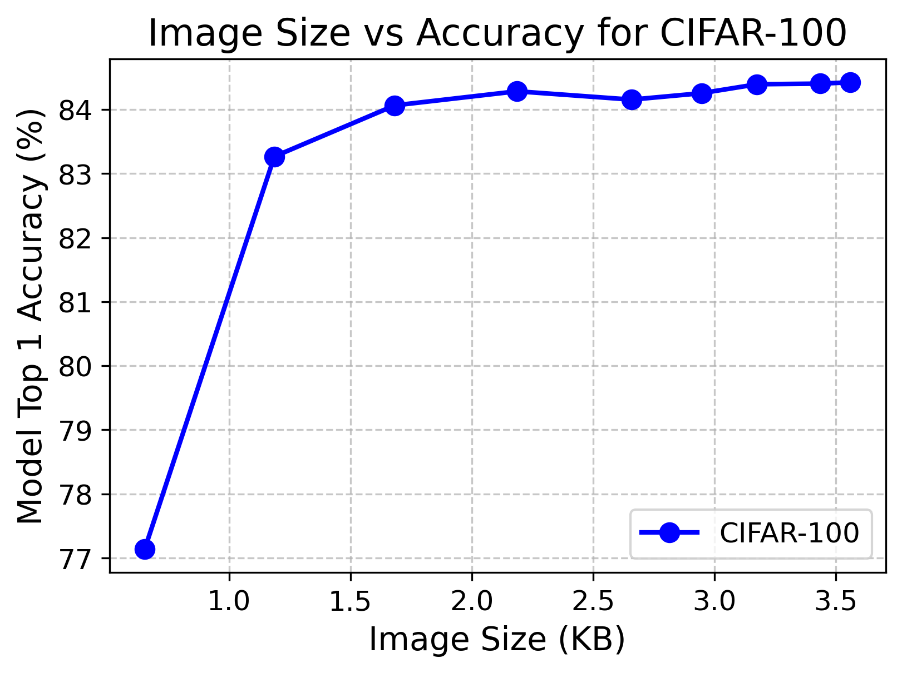
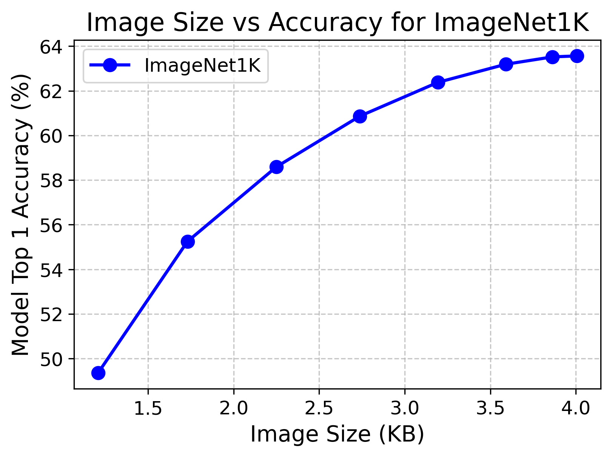

# LimitNet
Welcome to the LimitNet GitHub repository! This is the repository for our paper: **[LimitNet: Progressive, Content-Aware Image Offloading for Extremely Weak Devices & Networks (MobiSys'2024)](https://arxiv.org/pdf/2504.13736)**.

## Summary

IoT devices often struggle with advanced vision models due to limited hardware and remote deployments. Offloading tasks to the cloud is hindered by LPWANs' limited bandwidth and high packet loss, making time-sensitive inference difficult. Existing methods produce non-progressive bit streams, reducing decoding quality under these constraints. We introduce LimitNet, a progressive, content-aware image compression model for weak devices and networks. LimitNet's encoder prioritizes critical data during transmission, allowing the cloud to perform inference even with partial data. Experiments show LimitNet achieves up to 14.01 p.p. higher accuracy on ImageNet1000, 18.01 p.p. on CIFAR100, and 0.1 higher mAP@0.5 on COCO compared to SOTA. It also reduces bandwidth usage by up to 83.68% on CIFAR100, while only increasing encoding time by 4% compared to JPEG on STM32F7.

## Demo - LimitNet on video:

LimitNet can extract important parts of the input image and prioritize these parts in its progressive bitstream. This allows the cloud to reconstruct images and run inference at any point in time. To evaluate this, we compressed a video frame-by-frame with LimitNet and visualized its output at different points in time:

https://github.com/ds-kiel/LimitNet/assets/64225034/1b9bf93e-2c2a-4aca-a0d8-0902a086b496

[Video source](https://github.com/facebookresearch/dinov2) 

## Installation

To get started, clone the repository and install the required dependencies:

```
git clone https://github.com/ds-kiel/LimitNet.git
cd LimitNet
pip install -r requirements.txt
```


## Saliency dataset
LimitNet uses BASNet as the teacher for training the saliency detector branch. We used this model to extract the saliency maps on a subset of the ImageNet dataset which you can download it from here:

[](https://doi.org/10.5281/zenodo.12206178)


## Training

To train the LimitNet on the CIFAR100 dataset, run the following command:

```
python train.py --model cifar --batch_size 32 --imagenet_root <IMAGENET_ROOT> --checkpoint_dir checkpoint --wandb_name LimitNet --wandb_project LimitNet --cifar_classifier_model_path ./EfficientNet-CIFAR100
```
To train the LimitNet model on the ImageNet dataset, run the following command:

```
python train.py --model imagenet --batch_size 32 --imagenet_root <IMAGENET_ROOT> --checkpoint_dir checkpoint --wandb_name LimitNet --wandb_project LimitNet --cifar_classifier_model_path ./EfficientNet-ImageNet
```

## Evaluation

To evaluate the LimitNet on the ImageNet-1000 and CIFAR100 dataset, run the following command:

```
python eval.py --model cifar --model_path './LimitNet-CIFAR100' --batch_size 32 --data_root <DATA_ROOT> 
```

```
python eval.py --model imagenet --model_path './LimitNet-ImageNet'  --batch_size 32 --data_root <DATA_ROOT>
```

## Pre-trained model
You can find the pretrained weights for ImageNet-1000, CIFAR-100 and EfficientNet tuned on CIFAR-100 here:

[](https://doi.org/10.5281/zenodo.12516726)
[]([https://doi.org/10.5281/zenodo.12516726](https://zenodo.org/records/15019456))
## Compress an image
To evaluate the LimitNet model on an input image and generate a saliency map, use the following command. ``` --percentage ``` determines the percentage of latent variables that the cloud has been received.
```
python demo.py --model_path <MODEL_PATH> --image_path <IMAGE_PATH> --percentage <PERCENTAGE>
```

## Compress a video
To evaluate the LimitNet model on a video, use the following command. ``` --percentage ``` determines the percentage of latent variables that the cloud has been received. 

```
python process_video_frames.py --model <MODEL> --model_path <MODEL_PATH> --input_video <INPUT_VIDEO> --output_folder <OUTPUT_FOLDER> --output_video <OUTPUT_VIDEO> --percentage <PERCENTAGE> --frame_rate 30
```

## Results

| CIFAR-100 | ImageNet Results |
|-----------|------------------|
|  |  |

## Citation

```
@inproceedings{10.1145/3643832.3661856,
author = {Hojjat, Ali and Haberer, Janek and Zainab, Tayyaba and Landsiedel, Olaf},
title = {LimitNet: Progressive, Content-Aware Image Offloading for Extremely Weak Devices \& Networks},
year = {2024},
isbn = {9798400705816},
publisher = {Association for Computing Machinery},
address = {New York, NY, USA},
url = {https://doi.org/10.1145/3643832.3661856},
doi = {10.1145/3643832.3661856},
booktitle = {Proceedings of the 22nd Annual International Conference on Mobile Systems, Applications and Services},
pages = {519–533},
numpages = {15},
location = {Minato-ku, Tokyo, Japan},
series = {MOBISYS '24}
}
```
